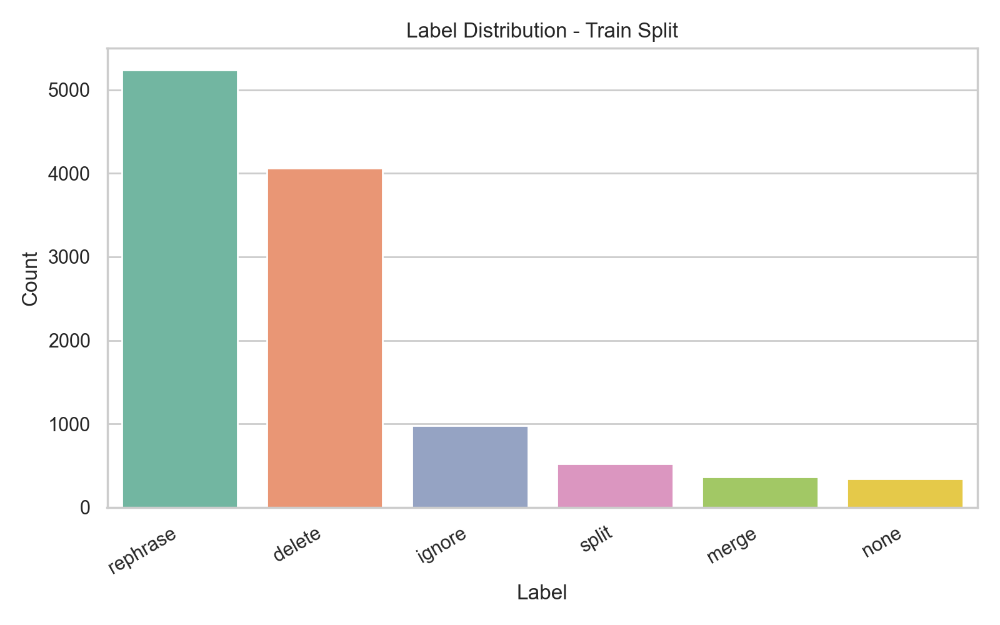
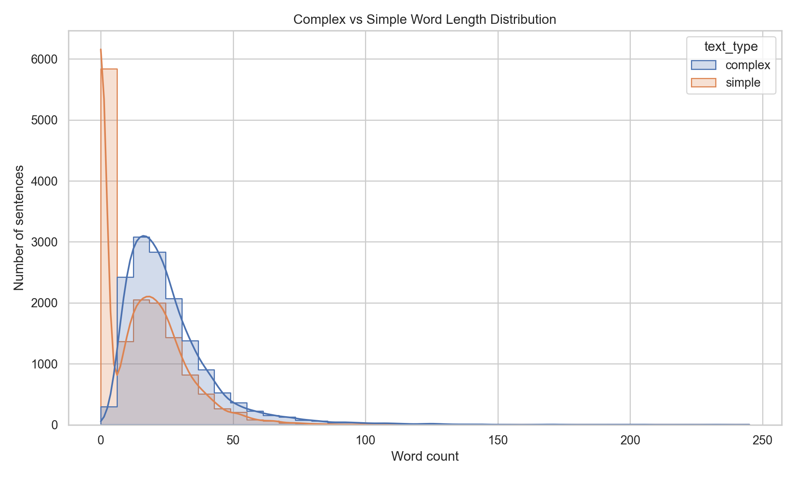
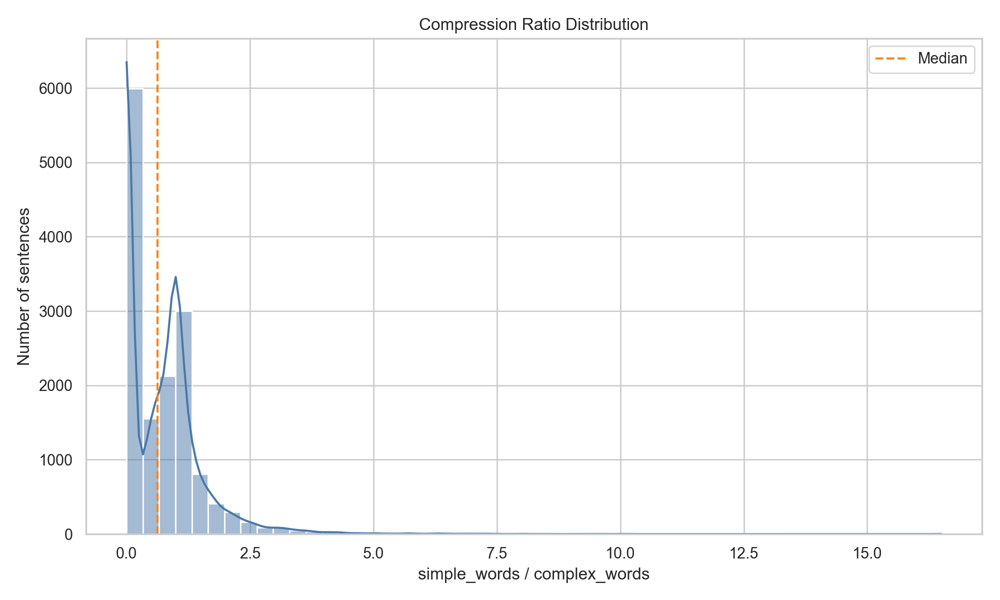
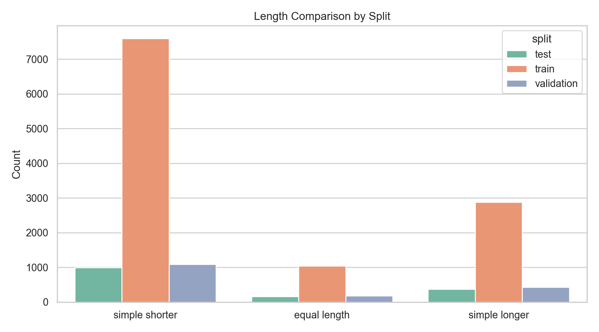
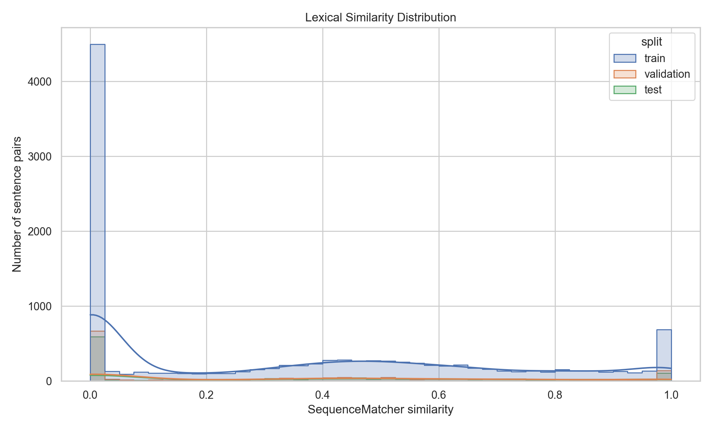

# Dataset Analysis: Cochrane-auto Sentence-level Simplification

This report summarizes the sentence-level Cochrane-auto splits used for CLEF SimpleText Task 1.1.

## Dataset Sizes

| split      | rows  |
|------------|-------|
| test       | 1512  |
| train      | 11510 |
| validation | 1697  |

## Original Dataset Columns

`pair_id`, `para_id`, `sent_id`, `complex`, `label`, `simple`, `simp_sent_id`, `doc_pos`, `doc_quint`, `doc_len`

The notebook creates additional analysis columns after loading the raw CSV files.

## Derived Analysis Columns

`complex_words`, `simple_words`, `compression_ratio`, `length_comparison`, `lexical_similarity`

## Missing Values in Original Columns

No missing values were detected by pandas.

## Label Distribution

| split      | label    | count | percentage |
|------------|----------|-------|------------|
| train      | rephrase | 5239  | 45.52%     |
| train      | delete   | 4063  | 35.30%     |
| train      | ignore   | 982   | 8.53%      |
| train      | split    | 521   | 4.53%      |
| train      | merge    | 365   | 3.17%      |
| train      | none     | 340   | 2.95%      |
| validation | rephrase | 758   | 44.67%     |
| validation | delete   | 592   | 34.89%     |
| validation | ignore   | 168   | 9.90%      |
| validation | merge    | 64    | 3.77%      |
| validation | split    | 58    | 3.42%      |
| validation | none     | 57    | 3.36%      |
| test       | rephrase | 667   | 44.11%     |
| test       | delete   | 537   | 35.52%     |
| test       | ignore   | 148   | 9.79%      |
| test       | split    | 77    | 5.09%      |
| test       | merge    | 43    | 2.84%      |
| test       | none     | 40    | 2.65%      |

## Length Summary

| split      | complex_words_mean | complex_words_min | complex_words_max | complex_words_median | simple_words_mean | simple_words_min | simple_words_max | simple_words_median |
|------------|--------------------|-------------------|-------------------|----------------------|-------------------|------------------|------------------|---------------------|
| test       | 25.99              | 4                 | 233               | 22.0                 | 14.62             | 0                | 144              | 13.0                |
| train      | 25.94              | 0                 | 245               | 22.0                 | 14.56             | 0                | 144              | 13.0                |
| validation | 25.43              | 4                 | 203               | 21.0                 | 14.35             | 0                | 117              | 13.0                |

## Length Comparison

| split      | length_comparison | count | percentage |
|------------|-------------------|-------|------------|
| test       | simple shorter    | 987   | 65.28%     |
| test       | equal length      | 156   | 10.32%     |
| test       | simple longer     | 369   | 24.40%     |
| train      | simple shorter    | 7591  | 65.95%     |
| train      | equal length      | 1038  | 9.02%      |
| train      | simple longer     | 2881  | 25.03%     |
| validation | simple shorter    | 1090  | 64.23%     |
| validation | equal length      | 180   | 10.61%     |
| validation | simple longer     | 427   | 25.16%     |

## Compression Ratio and Lexical Similarity

| split      | compression_ratio_mean | compression_ratio_min | compression_ratio_max | compression_ratio_median | lexical_similarity_mean | lexical_similarity_min | lexical_similarity_max | lexical_similarity_median |
|------------|------------------------|-----------------------|-----------------------|--------------------------|-------------------------|------------------------|------------------------|---------------------------|
| test       | 0.698                  | 0.0                   | 7.571                 | 0.65                     | 0.351                   | 0.0                    | 1.0                    | 0.327                     |
| train      | 0.691                  | 0.0                   | 10.0                  | 0.625                    | 0.339                   | 0.0                    | 1.0                    | 0.304                     |
| validation | 0.71                   | 0.0                   | 16.5                  | 0.619                    | 0.344                   | 0.0                    | 1.0                    | 0.32                      |

## Key Observations

- The most frequent training label is `rephrase` (5239 rows, 45.52%).
- Median sentence length changes from 22.0 complex words to 13.0 simple words.
- Across all splits, the most common length relationship is `simple shorter` (9668 rows).
- The median compression ratio is 0.628; values below 1.0 indicate shorter simplified text.
- The median lexical similarity is 0.309, measured with difflib.SequenceMatcher on lowercased text.
- There are 5664 rows with empty simplified text, including delete-label examples (5192 delete rows).

## Generated Figures

### Label Distribution - Train

### Complex and Simple Length Distribution

### Compression Ratio Distribution

### Length Comparison

### Lexical Similarity Distribution

## Sentence No-context Preprocessing

For the first sentence-level experiment without document context, the preprocessing script keeps only `rephrase`, `ignore`, and `split` examples. It removes `delete`, `merge`, and `none` examples, parses the `simple` column into `target_text`, and removes rows with empty targets.

Processed dataset sizes:

| split | original rows | processed rows |
|-------|---------------|----------------|
| train | 11,510        | 6,742          |
| val   | 1,697         | 984            |
| test  | 1,512         | 892            |

Processed files:

- `data/processed/sentence_no_context/train.csv`
- `data/processed/sentence_no_context/val.csv`
- `data/processed/sentence_no_context/test.csv`
