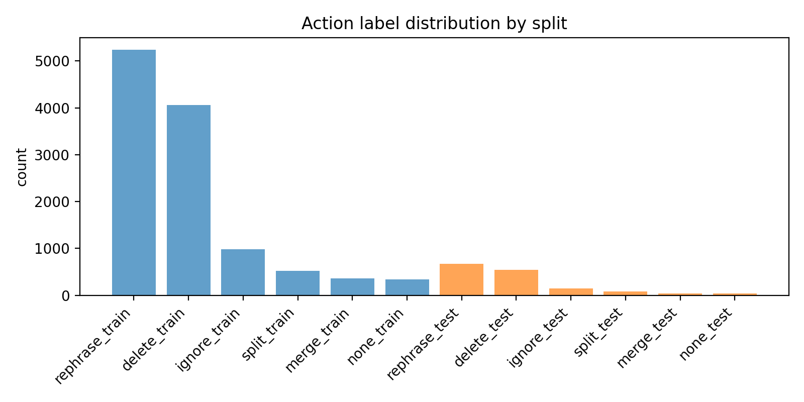
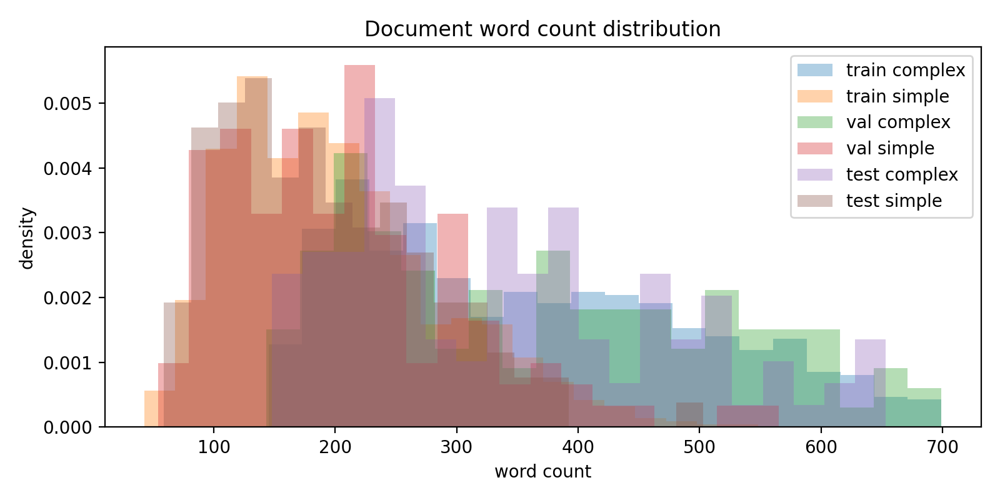
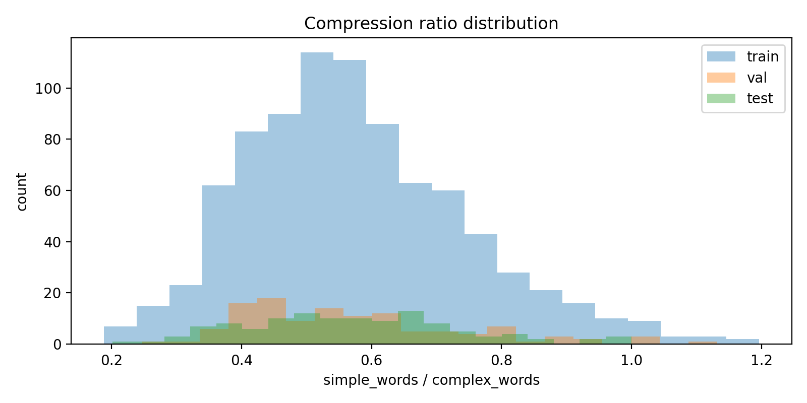
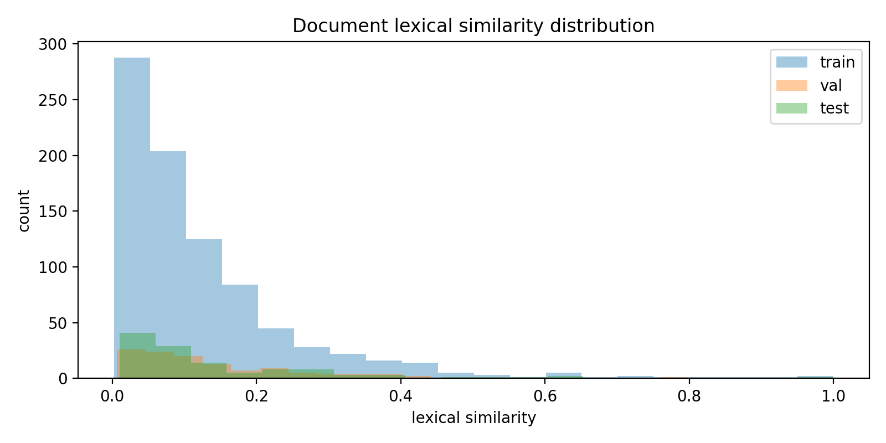
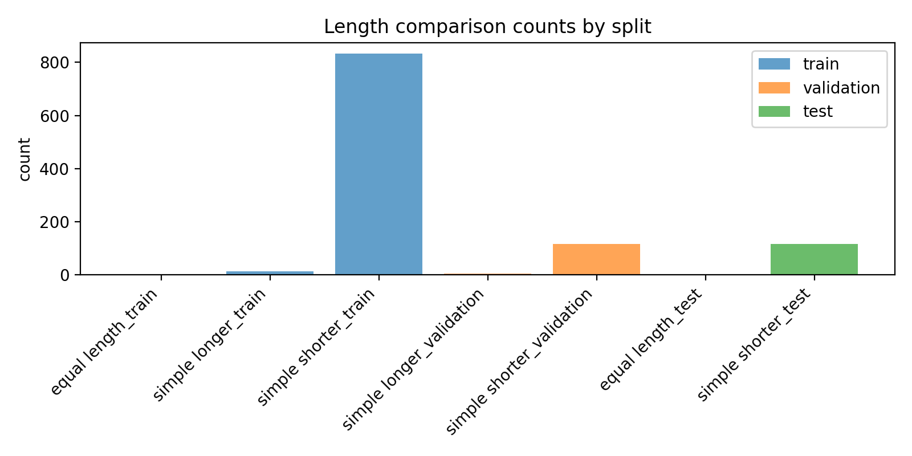
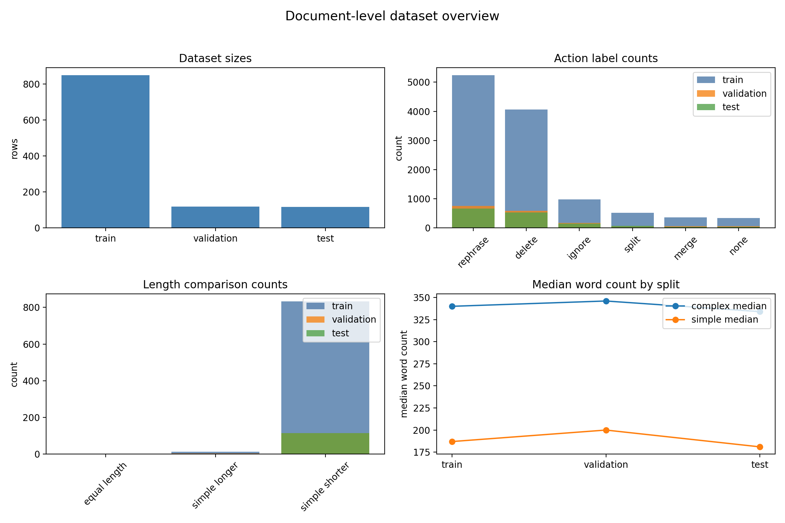
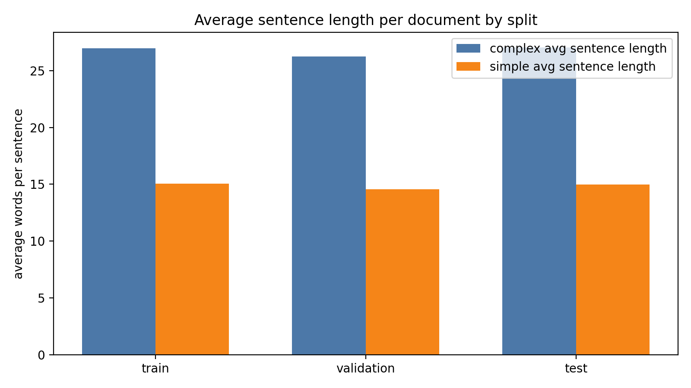
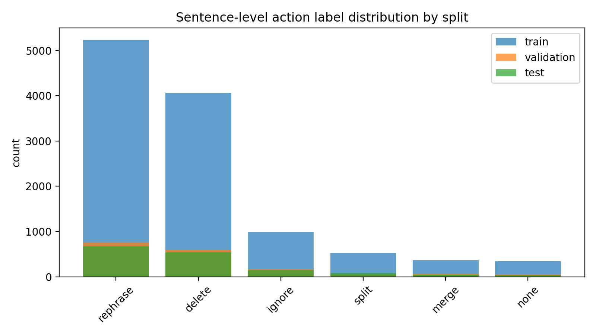

# Dataset Analysis: Cochrane-auto Document-level Simplification

This report summarizes the document-level Cochrane-auto splits used for CLEF SimpleText Task 1.1.

## Dataset Sizes

| split      | rows |
| ---------- | ---: |
| train      |  849 |
| validation |  119 |
| test       |  117 |

## Original Dataset Columns

`pair_id`, `complex`, `simple`, `para_id`, `sent_id`, `label`, `simp_sent_id`, `doc_pos`, `doc_quint`, `doc_len`

## Derived Analysis Columns

`complex_words`, `simple_words`, `compression_ratio`, `length_comparison`, `lexical_similarity`, `sentence_action_count`

## Missing Values in Original Columns

| column       | missing |
| ------------ | ------: |
| pair_id      |       0 |
| complex      |       0 |
| simple       |       0 |
| para_id      |       0 |
| sent_id      |       0 |
| label        |       0 |
| simp_sent_id |       0 |
| doc_pos      |       0 |
| doc_quint    |       0 |
| doc_len      |       0 |

## Sentence-level Action Distribution

These labels are not document-level tags. Each document row contains a list of action labels for the sentences inside that document, so the counts below reflect sentence-level operations aggregated across the document splits.

| split      | label    | count | percentage |
| ---------- | -------- | ----: | ---------: |
| test       | delete   |   537 |     35.52% |
| test       | ignore   |   148 |      9.79% |
| test       | merge    |    43 |      2.84% |
| test       | none     |    40 |      2.65% |
| test       | rephrase |   667 |     44.11% |
| test       | split    |    77 |      5.09% |
| train      | delete   |  4063 |     35.30% |
| train      | ignore   |   982 |      8.53% |
| train      | merge    |   365 |      3.17% |
| train      | none     |   340 |      2.95% |
| train      | rephrase |  5239 |     45.52% |
| train      | split    |   521 |      4.53% |
| validation | delete   |   592 |     34.89% |
| validation | ignore   |   168 |      9.90% |
| validation | merge    |    64 |      3.77% |
| validation | none     |    57 |      3.36% |
| validation | rephrase |   758 |     44.67% |
| validation | split    |    58 |      3.42% |

## Length Summary

| split      | complex_words_mean | complex_words_min | complex_words_max | complex_words_median | simple_words_mean | simple_words_min | simple_words_max | simple_words_median |
| ---------- | -----------------: | ----------------: | ----------------: | -------------------: | ----------------: | ---------------: | ---------------: | ------------------: |
| train      |             358.99 |               145 |               699 |               340.00 |            200.59 |               43 |              548 |              187.00 |
| validation |             369.64 |               143 |               699 |               346.00 |            207.71 |               54 |              565 |              200.00 |
| test       |             343.03 |               148 |               653 |               334.00 |            192.09 |               59 |              503 |              181.00 |

## Length Comparison

| split      | length_comparison | count | percentage |
| ---------- | ----------------- | ----: | ---------: |
| test       | equal length      |     2 |      1.71% |
| test       | simple shorter    |   115 |     98.29% |
| train      | equal length      |     3 |      0.35% |
| train      | simple longer     |    13 |      1.53% |
| train      | simple shorter    |   833 |     98.12% |
| validation | simple longer     |     4 |      3.36% |
| validation | simple shorter    |   115 |     96.64% |

## Compression Ratio and Lexical Similarity

| split      | compression_ratio_mean | compression_ratio_min | compression_ratio_max | compression_ratio_median | lexical_similarity_mean | lexical_similarity_min | lexical_similarity_max | lexical_similarity_median |
| ---------- | ---------------------: | --------------------: | --------------------: | -----------------------: | ----------------------: | ---------------------: | ---------------------: | ------------------------: |
| train      |                  0.575 |                 0.188 |                 1.196 |                    0.555 |                   0.126 |                  0.003 |                  1.000 |                     0.081 |
| validation |                  0.573 |                 0.247 |                 1.132 |                    0.535 |                   0.142 |                  0.007 |                  0.798 |                     0.108 |
| test       |                  0.571 |                 0.201 |                 1.000 |                    0.563 |                   0.144 |                  0.010 |                  0.999 |                     0.088 |

## Sentence Action Count per Document

| split      |  mean | min | max | median |
| ---------- | ----: | --: | --: | -----: |
| train      | 13.56 |   4 |  33 |  13.00 |
| validation | 14.26 |   5 |  36 |  13.00 |
| test       | 12.92 |   5 |  27 |  12.00 |

## Key Observations

- In the train split, the most frequent sentence-level action is `rephrase`.
- In the validation split, the most frequent sentence-level action is `rephrase`.
- In the test split, the most frequent sentence-level action is `rephrase`.
- Median document length changes from 340.00 complex words to 187.00 simple words in the training split.
- The median compression ratio is 0.554, and the median lexical similarity is 0.085.
- The average document contains 13.57 sentence-level actions (median 12.00).

## Generated Figures

### Action Label Distribution

### Document Length Distribution

### Compression Ratio Distribution

### Lexical Similarity Distribution

### Length Comparison

### Dataset Overview

### Average Sentence Length per Document

### Sentence-level Action Label Distribution

